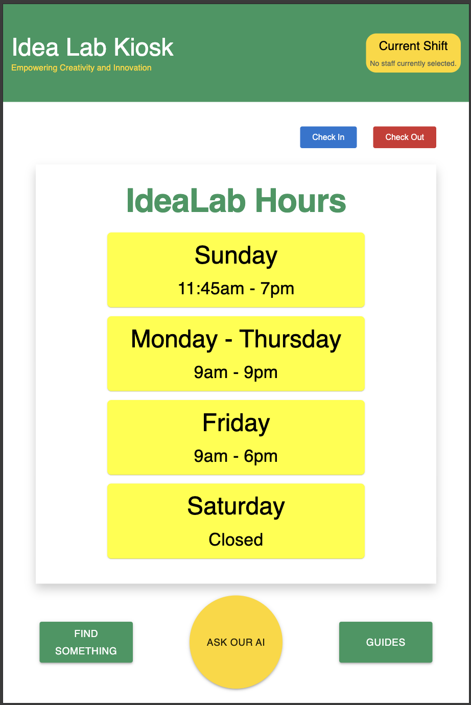
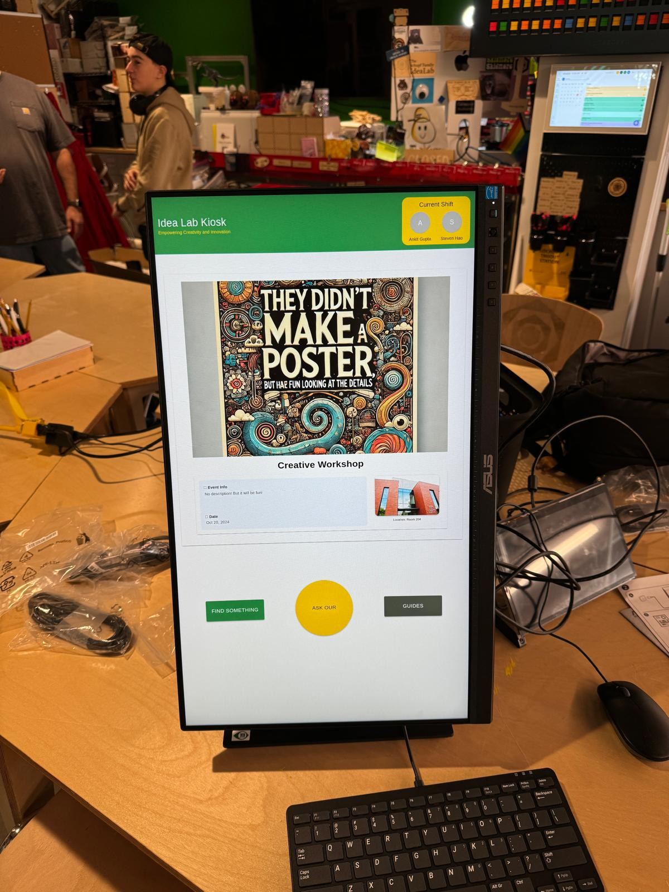
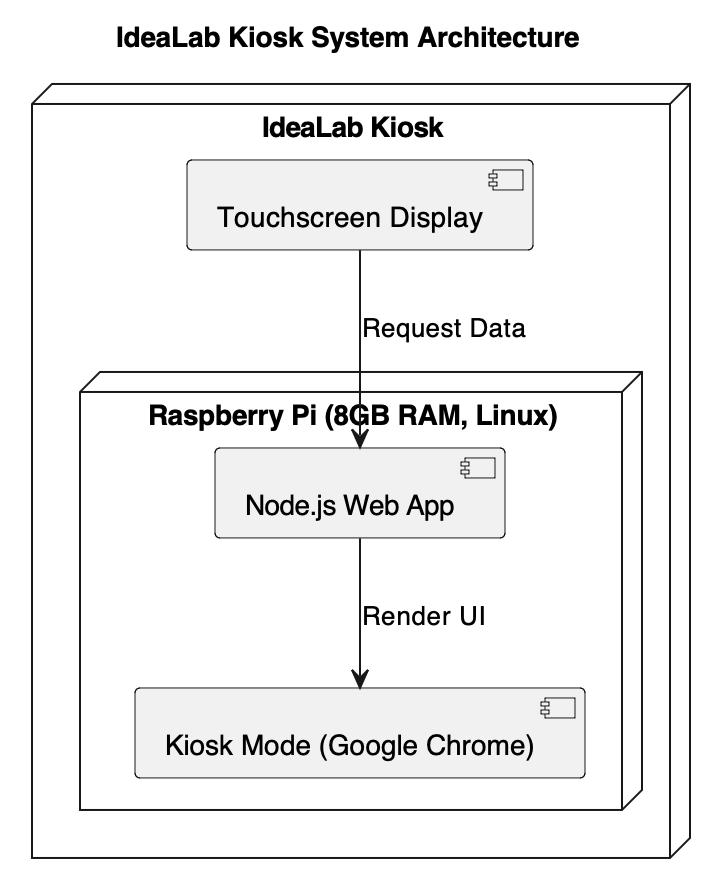

<!-- PROJECT SHIELDS
[![Contributors][contributors-shield]][contributors-url]
[![Forks][forks-shield]][forks-url]
[![Stargazers][stars-shield]][stars-url]
[![Issues][issues-shield]][issues-url]
[![Unlicense License][license-shield]][license-url]
[![LinkedIn][linkedin-shield]][linkedin-url] -->

<!-- PROJECT LOGO -->
 

  

  <h3 align="center">IDEA LAB KIOSK</h3>

  

    A organization management kiosk for IdeaLab at Skidmore College.
     
    <a href="https://github.com/akgupta2002D/IdeaLab_Kiosk.git"><strong>Explore the docs »</strong></a>
     
     
    <a href="https://github.com/akgupta2002D/IdeaLab_Kiosk.git">View Demo</a>
    &middot;
  

<!-- TABLE OF CONTENTS -->

  
Table of Contents

  <ol>
    <li>
      <a href="#about-the-project">About The Project</a>
      <ul>
        <li><a href="#built-with">Built With</a></li>
      </ul>
    </li>
    <li>
      <a href="#getting-started">Getting Started</a>
      <ul>
        <li><a href="#prerequisites">Prerequisites</a></li>
        <li><a href="#installation">Installation</a></li>
      </ul>
    </li>
    <li><a href="#usage">Usage</a></li>
    <li><a href="#roadmap">Roadmap</a></li>
    <li><a href="#contributing">Contributing</a></li>
    <li><a href="#license">License</a></li>
    <li><a href="#contact">Contact</a></li>
    <li><a href="#acknowledgments">Acknowledgments</a></li>
  </ol>

<!-- ABOUT THE PROJECT -->
<!-- ABOUT THE PROJECT -->
## About The Project

    
     
    <!-- Lets add a new picture here. -->

### Problem Statement
IdeaLab is a creative workspace at Skidmore College, equipped with various tools such as 3D printers, sewing machines, and craft materials. It serves as a hub for innovation, hosting frequent events to teach students how to use these tools and bring their ideas to life. However, as the space grew, managing events, tracking staff shifts, and providing machine guides became increasingly inefficient. There was no centralized system to display events, track student workers on shift, or provide instant access to usage guides for machines. 

### Proposed Solution
Recognizing these challenges, I proposed developing an **interactive kiosk system** to streamline operations at IdeaLab. The system automates key tasks such as event display, staff check-in, and access to machine guides. This not only reduces manual effort but also enhances the overall user experience for both students and staff.

### Project Overview
The IdeaLab Kiosk is a **custom-built interactive system** running on a Raspberry Pi (8GB RAM) with a Linux operating system. A batch script launches the kiosk mode, opening a Google Chrome instance that serves a web app in full-screen mode with no navigation options. This ensures seamless access to essential information while preventing unintended interruptions.

    

### Current Features:
1. **Event Display System** - A centralized panel that showcases upcoming events, including descriptions and locations, with automatic periodic slideshows.
2. **Check-In and Check-Out System for Staff** - Displays which student workers are currently on shift, making it easier to manage staffing.
3. **Machine Usage Guides** - Provides students with access to step-by-step guides for using machines, which can also be sent directly to their emails.

### Features in Development:
1. **Machine and Parts Locating System** - An interactive 2D map of IdeaLab, allowing users to locate tools, machines, and parts efficiently.
2. **AI ChatBot (RAG Model)** - A chatbot trained on IdeaLab documentation, acting as a virtual assistant to help students navigate the space and answer common questions.

By leveraging full-stack development expertise, this **first-of-its-kind system at Skidmore College** improves efficiency, accessibility, and user experience at IdeaLab, making it a more functional and engaging workspace.

(<a href="#readme-top">back to top</a>)

### Built With
* 
* 
* 
* 
* 
* 
* 

(<a href="#readme-top">back to top</a>)

<!-- ROADMAP -->
## Roadmap

- [x] Add Event Display System
- [x] Implement Check-In and Check-Out System for Staff
- [x] Develop Machine Usage Guide Feature
- [ ] Integrate Machine and Parts Locating System
- [ ] Deploy AI ChatBot (RAG Model) for Student Assistance
- [ ] Add Interactive Feedback System for Users
- [ ] Implement Multi-language Support
    - [ ] Chinese
    - [ ] Spanish
    - [ ] Nepali
- [ ] Build Mobile-Friendly Companion Web App
- [ ] Introduce User Authentication for Admin and Staff Management
- [ ] Develop Analytics Dashboard for Tracking Kiosk Usage
- [ ] Automate System Updates & Maintenance for Raspberry Pi
- [ ] Enable Offline Mode with Local Data Caching

See the [open issues](https://github.com/akgupta2002D/IdeaLab_Kiosk.git/issues) for a full list of proposed features (and known issues).

(<a href="#readme-top">back to top</a>)

<!-- CONTACT -->
## Contact

Ankit Gupta 

Project Link: [https://github.com/akgupta2002D/IdeaLab_Kiosk.git](https://github.com/akgupta2002D/IdeaLab_Kiosk.git)

(<a href="#readme-top">back to top</a>)

<!-- ACKNOWLEDGMENTS -->
## Acknowledgments

This section lists resources and tools that have been valuable in the development of the IdeaLab Kiosk. A big thank you to the following platforms and communities for their contributions to open-source learning and development:

* [The Odin Project](https://www.theodinproject.com/) - Comprehensive web development curriculum
* [CodePath Web Development](https://www.codepath.org/) - Structured learning for full-stack development
* [MDN Web Docs](https://developer.mozilla.org/) - Best resource for HTML, CSS, and JavaScript documentation
* [Choose an Open Source License](https://choosealicense.com) - Helps select the right license for open-source projects
* [GitHub Emoji Cheat Sheet](https://www.webpagefx.com/tools/emoji-cheat-sheet) - Quick reference for GitHub-flavored markdown emojis
* [Malven's Flexbox Cheatsheet](https://flexbox.malven.co/) - Essential guide for mastering CSS flexbox
* [Malven's Grid Cheatsheet](https://grid.malven.co/) - Reference for CSS Grid layout system
* [Img Shields](https://shields.io) - Customizable badges for GitHub projects
* [GitHub Pages](https://pages.github.com) - Free hosting for static sites
* [Font Awesome](https://fontawesome.com) - Icon library for UI design
* [React Icons](https://react-icons.github.io/react-icons/search) - Collection of popular icons for React projects
* [W3Schools](https://www.w3schools.com/) - Beginner-friendly tutorials for web technologies
* [Stack Overflow](https://stackoverflow.com/) - Community-driven Q&A for programming challenges

(<a href="#readme-top">back to top</a>)

